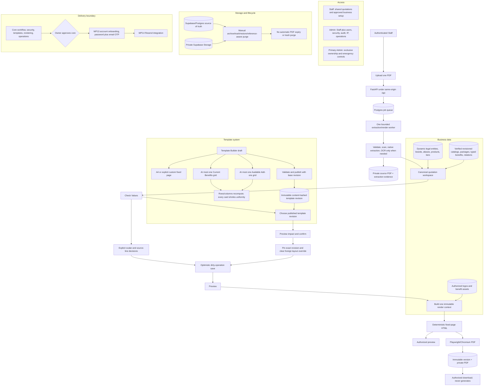

# Risklocker v7 Project Map

This is the current whole-system view. Authentication redesign and Resend remain deliberately outside the active core checkpoint.

Compatibility adapters keep legacy batches, drafts, manual benefit elements, templates, assets, and generated versions readable. New uploads are single-file, new benefit content uses dynamic grids, and destructive cleanup waits for reference checks.
