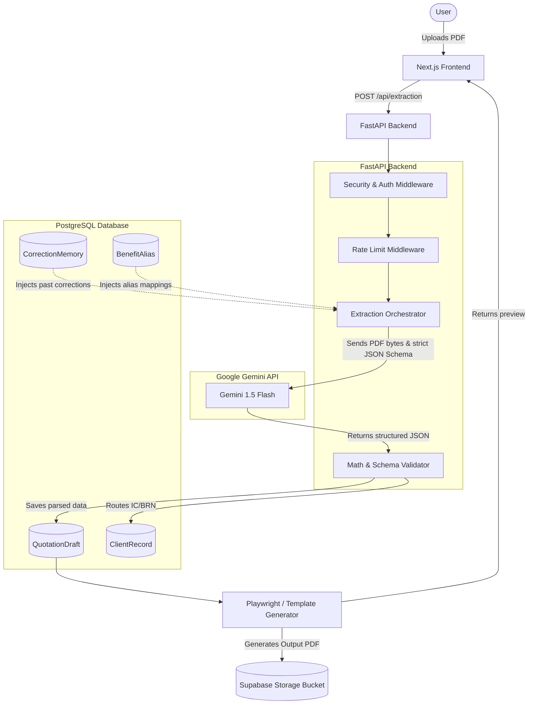

# RiskLocker Architecture & Pipeline Overview

This document provides a comprehensive end-to-end overview of the RiskLocker system architecture. It details exactly how a quotation flows through the system, how the AI extraction engine operates, how the self-learning memory is stored in the database, and how the final output is generated.

---

## 1. The Core Pipeline: From Upload to Output

The system operates as a unified pipeline managed by a FastAPI backend and a PostgreSQL database (hosted on Supabase).

1. **Ingestion & Security Routing:** 
   - A user uploads a PDF to the backend via a secure FastAPI endpoint (`/api/extraction/...`).
   - The route is protected by `RequestSecurityMiddleware` and `RateLimitMiddleware` to prevent abuse.
   - The PDF is temporarily held in memory, and its integrity is verified.

2. **Multimodal AI Extraction (The Gemini Engine):**
   - The file is passed to the `ExtractionOrchestrator` (`gemini_extractor.py`).
   - **Crucial Feature:** We do *not* just scrape the text layer. We pass the raw PDF file bytes directly to Google's Gemini 1.5 Flash model as an `inline_data` multimodal payload. This allows the AI to "see" the document visually, which is critical for reading complex tables, misaligned columns, and right-aligned pricing data (especially for companies like QBE and Lonpac).
   - The AI is strictly constrained by a JSON Schema. We force it to output exact fields: 
     - `client_type` (Private vs. Company)
     - `ic_or_brn` (IC Number or Business Registration Number)
     - `ncd_amount`, `premium`, `vehicle_no`, etc.

3. **The Database & Client Records:**
   - Once the JSON is returned from Gemini, the backend validates the math (e.g., ensuring negative signs are stripped from NCDs) and structures the data.
   - This data is saved into the PostgreSQL database. Specifically, it creates a `QuotationDraft` record, and sets the stage for populating `ClientRecord` tables—perfectly organizing whether the client is a Private individual or a Corporate entity with a representative.

4. **Output Generation:**
   - The extracted data is mapped onto a standardized layout. 
   - The system can then render this unified data into a beautiful, consistent PDF using headless browser automation (Playwright), ensuring that no matter how messy the original insurer's PDF was, the final output always matches the RiskLocker brand standard.

---

## 2. The RAG Learning Loop (Self-Improving Memory)

RiskLocker is designed to become completely autonomous through a Retrieval-Augmented Generation (RAG) loop. 

**How it works:**
- Sometimes, an insurer uses a weird, undocumented add-on code (e.g., `FC002A` for Liberty) or a completely new phrasing.
- If the AI extracts it incorrectly, a human agent can manually correct the mapping in the UI.
- When they hit "Save", this correction is permanently stored in the PostgreSQL database inside the `CorrectionMemory` and `BenefitAlias` tables.
- **The Loop:** The next time *any* user uploads a PDF from that same insurer, the `build_rag_system_prompt` function queries the database for all past corrections and injects them directly into Gemini's system instructions *before* it processes the PDF. 
- **Result:** The AI learns from the human correction and never makes the same mistake twice.

---

## 3. System Components & Connections

- **Frontend:** Next.js (React) application that provides the interactive drag-and-drop UI and the visual review phase for correcting the AI.
- **Backend Routing:** FastAPI handles all business logic, strictly separated into routers (`routes.py`) and dependency injection (`deps.py`) to ensure every request is tied to a verified `AuthSession`.
- **Database (Supabase/PostgreSQL):** Uses SQLAlchemy ORM to manage dozens of interconnected tables (`tables.py`), ranging from `InsuranceCompany` configurations, `BenefitCatalog` dictionaries, to `ClientRecord` management.
- **File Storage:** Private PDF drafts and generated outputs are securely streamed to Supabase Storage buckets, heavily guarded by JWT authentication to prevent unauthorized document access.

---

## 4. System Flow Diagram

