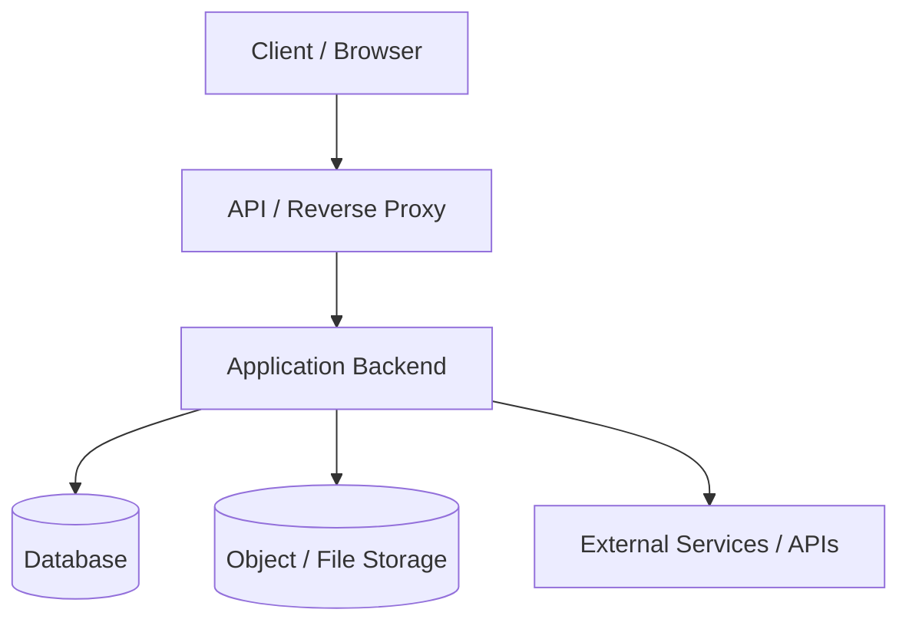

# System Architecture

## 1. System Overview & Boundaries

Describe the high-level architecture of `{{PROJECT_NAME}}`, its primary components, and its boundaries.

## 2. Core Subsystems

| Subsystem | Technology | Responsibility |
| :--- | :--- | :--- |
| **Frontend** | `{{FRONTEND_TECH}}` | UI components, user workflows, client state management |
| **Backend** | `{{BACKEND_TECH}}` | API endpoints, business logic, authentication & authorization |
| **Database** | `{{DB_TECH}}` | Relational models, migrations, transactional data |
| **Storage** | `{{STORAGE_TECH}}` | Persistent assets, documents, media files |

## 3. Data Flow & Lifecycles

- **Authentication Flow**: Describe how tokens/sessions are issued and verified.
- **Request Lifecycle**: How requests enter the system, pass through middleware, execute business services, and persist state.
- **Background Processing**: How async jobs or worker tasks are queued and processed.

## 4. Key Architectural Decisions (ADRs)

1. **Decision 1**: Document significant technical choices, rationale, and trade-offs.
2. **Decision 2**: Keep this section updated whenever system boundaries change.
