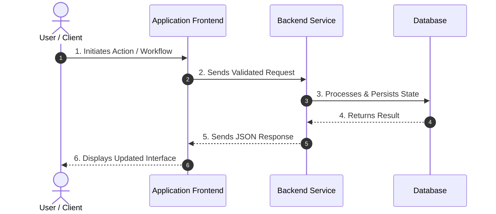
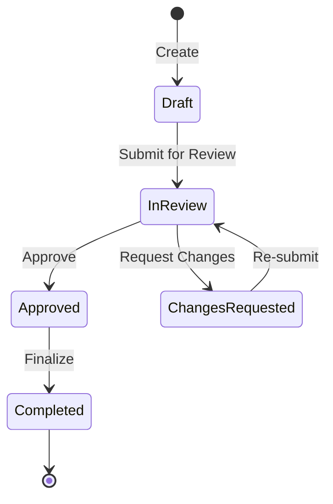

# Project Diagrams & Workflows

## 1. End-to-End User Flow

```mermaid
sequenceDiagram
    autonumber
    actor User as User / Client
    participant App as Application Frontend
    participant API as Backend Service
    participant DB as Database

    User->>App: 1. Initiates Action / Workflow
    App->>API: 2. Sends Validated Request
    API->>DB: 3. Processes & Persists State
    DB-->>API: 4. Returns Result
    API-->>App: 5. Sends JSON Response
    App-->>User: 6. Displays Updated Interface
```

## 2. Core State Machine / Lifecycle

```mermaid
stateDiagram-v2
    [*] --> Draft : Create
    Draft --> InReview : Submit for Review
    InReview --> Approved : Approve
    InReview --> ChangesRequested : Request Changes
    ChangesRequested --> InReview : Re-submit
    Approved --> Completed : Finalize
    Completed --> [*]
```
